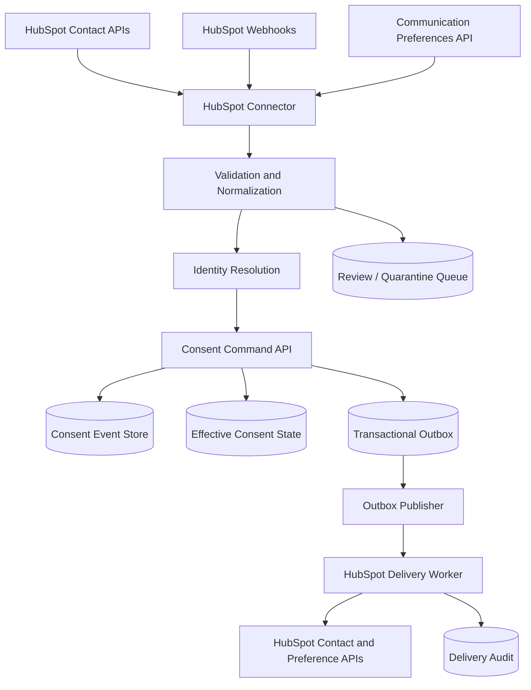

# HubSpot Consent Connector — Production Implementation Specification

**Version:** 1.0
**Date:** 2026-08-10
**Status:** Authoritative build specification
**Sources:** Merges the implementation handoff (Doc B — mechanics) with the Sentinel architecture spec (Doc A — consent policy). Supersedes both for implementation purposes. `meta-ai-consent-sol.md` (Doc C) is **not** an input; its verified errors are listed in `docs/design-history/design-comparison-and-recommendation.md`. Source design documents are archived in `docs/design-history/`.

---

## 1. Objective and authority model

Build a production-grade, bidirectional HubSpot connector for the central consent platform ("the Platform"):

```text
HubSpot (inbound)
  → Connector ingestion → Identity resolution → Evidence validation
  → Consent DB (immutable events) → Effective consent state
  → Transactional outbox → Delivery worker → HubSpot (outbound)
```

Authority model:

- **The Platform is the consent system of record.** HubSpot may capture and consume consent but never owns the canonical event history.
- HubSpot is (a) a source of contact and email-subscription preference data, and (b) an enforcement destination for supported email subscription types.
- Every consent grant or withdrawal is an **immutable, append-only event**; current state is always derived, never edited in place.
- A change is complete only when: the consent event is committed AND effective state is recalculated AND the outbox event is published AND the HubSpot update is delivered (or in a controlled retry/review state) AND a delivery receipt is stored.
- HubSpot unavailability must never roll back or discard a withdrawal recorded in the Platform.

---

## 2. Consent policy layer (what counts as consent)

This section is binding on the validation service. It is the compliance core of the connector.

### 2.1 Signals that are NEVER consent

| HubSpot signal | Treatment |
|---|---|
| Form submission without an explicit, unbundled consent field | Operational submission only |
| Marketing-contact status, list/workflow enrollment, lifecycle stage, deal activity | CRM classification/automation only |
| Page views, tracking-cookie events, email opens/clicks/replies | Engagement only |
| Logged SMS, WhatsApp, call, or LinkedIn communication | Engagement record; never channel consent |
| Contact creation or property change | Change signal only; fetch authoritative state before processing |
| Clearing an opt-out field / flipping `hs_email_optout` to false | **Not** renewed consent |
| Blank, missing, or ambiguous values | `UNKNOWN`, never `GRANTED` |

### 2.2 Requirements for a consent GRANT

A grant event may be created only when ALL of the following are present:

1. Exactly one resolved party (Data Principal).
2. A specific mapped purpose, channel, brand, and jurisdiction.
3. An unambiguous affirmative action by the person (or verified representative).
4. Consent statement text or an immutable statement hash.
5. Privacy notice ID, version, language, and presentation context.
6. Source timestamp, form/property provenance, and collection channel.
7. HubSpot source reference (portal + object type + contact ID) and a tamper-evident payload hash.
8. A client-approved, versioned mapping profile active at the time of the source event.

If any element is missing: `effective_status = UNKNOWN`, `review_reason = INSUFFICIENT_SOURCE_EVIDENCE`, record quarantined. Incomplete evidence MAY create a conservative suppression event; it must NEVER create a grant.

### 2.3 Requirements for a WITHDRAWAL / unsubscribe

Reliable subscriber identity, subscription-type or global scope, effective timestamp, source reference, and integrity evidence. Withdrawals are accepted more permissively than grants (restrictive direction is safe).

### 2.4 Precedence rules

1. Apply the most restrictive effective state immediately.
2. A valid newer withdrawal overrides an older grant.
3. An older HubSpot update cannot reverse a newer Platform withdrawal (enforced by `consentVersion`, §9.3).
4. A new grant after withdrawal requires fresh affirmative evidence.
5. Unknown ordering, identity collision, or mapping conflict → quarantine.

### 2.5 Form-based consent capture

For a HubSpot form to be an approved consent source, retain: form ID and immutable revision; exact checkbox label and statement (or hashes); notice ID/version/language/link; the purpose/subscription mapping active at submission; affirmative value, timestamp, page context, channel; submission/contact reference and payload hash; guardian evidence when applicable.

Pre-checked boxes, bundled purposes, and ambiguous language disqualify the source. If HubSpot cannot retain sufficient presentation evidence, capture evidence in the Platform at collection time and use HubSpot only for downstream enforcement.

### 2.6 Channel scope

The Communication Preferences API governs **email only**. SMS, WhatsApp, calling, and custom channels are out of scope for this connector and must return `NOT_SUPPORTED`; route them through their approved channel systems. Never represent email preference state as covering other channels.

---

## 3. Architecture



Components: OAuth service, webhook receiver, initial-load worker, delta-sync worker, preference reader, normalizer, identity resolver, consent service (validation per §2), state projector, transactional outbox, HubSpot writer, reconciliation worker, audit service, review queue.

---

## 4. Authentication and installation

### 4.1 Application model

| Deployment | Authentication |
|---|---|
| One known HubSpot account | Private application token |
| Multi-tenant product | OAuth application (use this for the productized connector) |

### 4.2 Scopes

Minimum: `crm.objects.contacts.read`, `crm.objects.contacts.write` (write only when outbound is enabled), plus the current scopes for communication-preference read/write and the chosen webhook model. Do not hard-code scope assumptions: validate granted scopes after installation and surface missing capabilities in connector health.

### 4.3 OAuth lifecycle

1. Administrator initiates installation.
2. Redirect to HubSpot authorization URL with `state` (and PKCE where the app model supports it).
3. Validate returned `state` and exact redirect URI; confirm the authorized portal identity.
4. Exchange the code for access + refresh tokens.
5. Encrypt tokens with tenant-scoped keys in a secrets manager; never log tokens, codes, or webhook secrets.
6. Cache the short-lived access token; refresh before expiry or after an authorized `401`.
7. Mark connector `AUTHORIZATION_REQUIRED` if refresh is revoked; disable credentials on uninstall.
8. Support rotation and revocation on disconnect.

---

## 5. Connector configuration

```yaml
connectorId: CONN-HUBSPOT-001
tenantId: TENANT-100
type: HUBSPOT
hubspotPortalId: "987654"
enabled: true
direction: { inbound: true, outbound: true }
authentication: { type: OAUTH, secretReference: secrets/hubspot/tenant-100 }
identity:
  matchingPolicy: STRICT
  partyIdProperty: consent_party_id
  enterpriseCustomerIdProperty: external_customer_id
sync:
  webhooksEnabled: true
  deltaPullEnabled: true
  reconciliationSchedule: "0 2 * * *"
  overlapMinutes: 5
  pageSize: 100
  preferencePollMinutes: 60        # tenant-level SLA for detecting footer unsubscribes (§8.5)
provisioning: { createMissingContacts: false }
enforcement:
  pendingStatus: DO_NOT_SEND
  unknownStatus: DO_NOT_SEND
  unavailablePolicy: FAIL_CLOSED
fieldMappings:
  email: email
  firstName: firstname
  lastName: lastname
  phone: phone
  partyId: consent_party_id
  consentSyncStatus: consent_sync_status
  consentVersion: consent_version
  consentUpdatedAt: consent_last_updated
purposeMappings:                    # via versioned mapping profiles only (§5.1)
  MARKETING_INFORMATION: EMAIL_MARKETING
  PRODUCT_UPDATES: PRODUCT_UPDATES
```

### 5.1 Versioned mapping profiles (mandatory)

Each HubSpot subscription type maps to exactly one Platform purpose version through a client-approved, versioned, effective-dated mapping profile:

```json
{
  "mappingProfileId": "hubspot-map-us-01",
  "version": "1.0.0",
  "portalId": "987654",
  "businessUnitId": "0",
  "subscriptionTypeId": "98765",
  "purposeId": "EMAIL_MARKETING",
  "purposeVersion": "3.1",
  "channel": "EMAIL",
  "legalBasis": "CONSENT",
  "direction": "BIDIRECTIONAL"
}
```

Rules: subscription-type **ID** is authoritative (names are display metadata); brand/business-unit aware where Brands is enabled; mapping changes are versioned and effective-dated; **never reinterpret historical evidence using a later mapping**; unknown subscription type or brand → quarantine until an approved mapping exists. `direction` gates writeback per mapping.

### 5.2 HubSpot custom properties

| Property | Type | Purpose |
|---|---|---|
| `consent_party_id` | Unique text | Canonical party identifier |
| `consent_sync_status` | Enum | `PENDING`, `SYNCED`, `REVIEW_REQUIRED`, `ERROR` |
| `consent_version` | Number | Last consent version applied |
| `consent_last_updated` | Datetime | Effective consent update time |
| `consent_source` | Enum | Origin system |
| `email_marketing_status` | Enum | Effective state, for visibility |
| `consent_correlation_id` | Text | Loop prevention and audit |
| `consent_updated_by` | Enum | `CONSENT_PLATFORM`, `HUBSPOT`, `USER` |

Custom properties are for routing/visibility only. **They never enforce email** — native subscription status must also be synchronized (§9.2).

---

## 6. Canonical data model

### 6.1 External identity mapping

```json
{
  "tenantId": "TENANT-100",
  "partyId": "PARTY-9001",
  "sourceSystem": "HUBSPOT",
  "sourceTenantId": "987654",
  "sourceObjectType": "CONTACT",
  "sourceRecordId": "123456",
  "mappingStatus": "VERIFIED",
  "matchMethod": "ENTERPRISE_CUSTOMER_ID",
  "sourceUpdatedAt": "2026-08-10T14:25:00Z"
}
```

```sql
UNIQUE (tenant_id, source_system, source_tenant_id, source_object_type, source_record_id)
```

The source key is always `portal ID + object type + contact ID`. **Email is a matching attribute, never a primary key.**

### 6.2 Consent event (immutable, append-only)

Doc B's event enriched with Doc A's evidence block — evidence fields are REQUIRED for grants, optional for withdrawals:

```json
{
  "eventId": "CEVT-100045",
  "tenantId": "TENANT-100",
  "partyId": "PARTY-9001",
  "eventType": "WITHDRAWN",
  "purposeCode": "EMAIL_MARKETING",
  "purposeVersion": "3.1",
  "channel": "EMAIL",
  "brandCode": "BRAND-A",
  "jurisdiction": "IN",
  "status": "WITHDRAWN",
  "effectiveAt": "2026-08-10T14:30:00Z",
  "capturedAt": "2026-08-10T14:30:00Z",
  "captureChannel": "HUBSPOT",
  "source": {
    "system": "HUBSPOT",
    "portalId": "987654",
    "businessUnitId": "0",
    "objectType": "EMAIL_SUBSCRIPTION_STATUS",
    "objectId": "123456",
    "subscriptionTypeId": "98765",
    "sourceEventId": "hubspot-event-789"
  },
  "evidence": {
    "method": "HUBSPOT_SUBSCRIPTION_UNSUBSCRIBE",
    "noticeId": "marketing-notice",
    "noticeVersion": "v4",
    "noticeLanguage": "en",
    "statementHash": "sha256:...",
    "affirmativeAction": null,
    "formId": null,
    "formVersion": null,
    "presentationContext": null,
    "actorType": "DATA_PRINCIPAL",
    "payloadHash": "sha256:..."
  },
  "mapping": { "profileId": "hubspot-map-us-01", "version": "1.0.0" },
  "identityMatchMethod": "VERIFIED_EMAIL_HASH",
  "idempotencyKey": "HUBSPOT:987654:CONTACT:123456:98765:sha256-...",
  "consentVersion": 17,
  "recordedAt": "2026-08-10T14:30:01Z"
}
```

### 6.3 Effective consent state

Derivation key: `tenant + party + brand + purpose + channel + jurisdiction`. Stores `effectiveStatus`, `consentVersion`, `effectiveAt`, `derivedFromEventId`. Statuses: `GRANTED`, `WITHDRAWN`, `UNKNOWN`, `SUPPRESSED`, `PENDING`.

### 6.4 Delivery receipt

`deliveryId, eventId, destinationSystem, destinationTenantId, destinationRecordId, consentVersion, status, attemptCount, deliveredAt, responseCode`.

---

## 7. Inbound: initial full pull

1. `GET https://api.hubapi.com/crm/v3/objects/contacts?limit=100&properties=email,firstname,lastname,phone,hs_object_id,hs_createdate,hs_lastmodifieddate,consent_party_id,external_customer_id,consent_sync_status,consent_version,consent_last_updated`
2. Cursor pagination via `paging.next.after`; stop when absent.
3. Process each page transactionally; advance the durable cursor only after the page is normalized, stored, and queued for follow-up. **Checkpoint advancement occurs only after every item is accepted, deduplicated, or durably quarantined.**
4. Job must resume safely from the last committed page after any failure.

Production requirements on the HubSpot client: token refresh, `429`/`Retry-After` handling, exponential backoff with jitter, metrics, structured redacted logging. Isolate every vendor call behind the HubSpot client module.

---

## 8. Inbound: preferences, deltas, webhooks

### 8.1 Native communication preferences

`GET /communication-preferences/v3/status/email/{emailAddress}` (keyed by **email**, not contact ID). Map statuses through the mapping profile. A "subscribed" status is a grant **candidate only** — it still passes §2.2 evidence validation or the tenant's approved import policy; "unsubscribed" creates a withdrawal/suppression for the mapped purpose; global unsubscribe suppresses **all** mapped email purposes.

### 8.2 Incremental pull

CRM Search on `hs_lastmodifieddate` (`POST /crm/v3/objects/contacts/search`), sorted ascending, limit 200. Watermark policy:

```text
query_from = last_successful_watermark - overlapMinutes
```

Advance the watermark only after all returned pages commit; store the **max observed source modification time**, never local job time. Overlap prevents boundary loss; idempotency absorbs the resulting duplicates.

### 8.3 Webhooks

Subscribe to: `contact.creation`, `contact.propertyChange`, `contact.merge`, `contact.deletion`, `contact.privacyDeletion`.

Receiver flow: (1) read raw body; (2) validate the current HubSpot signature (v3: HMAC-SHA256 over method + URI + body + timestamp with the app secret — validate against the raw body, per current HubSpot docs); (3) reject outside the replay window; (4) dedupe on `tenant + portal + event type + source event ID`; (5) persist a sanitized envelope; (6) enqueue; (7) return 2xx fast — no synchronization inside the HTTP request; (8) the worker **fetches the full contact** because payloads may be partial. Treat delivery as at-least-once; all processing idempotent.

**A webhook is a notification, not consent evidence.** Always retrieve and validate authoritative state before appending an event.

### 8.4 Layered recovery

Webhooks for speed; delta pull for missed events; scheduled reconciliation (§11) for drift. All three run in production — never webhook-only.

### 8.5 Footer-unsubscribe coverage (SLA)

Contact webhooks may not fire for native subscription-status changes (e.g., email-footer unsubscribes). Verify actual webhook coverage in each portal during implementation; regardless of the answer, poll preference status for recently active contacts on the `preferencePollMinutes` cadence and treat that cadence as a tenant-level detection SLA for unsubscribes.

---

## 9. Outbound: push consent to HubSpot

### 9.1 CRM property update

```http
PATCH /crm/v3/objects/contacts/{contactId}
```

```json
{
  "properties": {
    "consent_party_id": "PARTY-9001",
    "consent_sync_status": "SYNCED",
    "email_marketing_status": "WITHDRAWN",
    "consent_version": "17",
    "consent_last_updated": "2026-08-10T14:30:00Z",
    "consent_source": "CONSENT_PLATFORM",
    "consent_correlation_id": "CORR-123",
    "consent_updated_by": "CONSENT_PLATFORM"
  }
}
```

### 9.2 Native subscription update (mandatory for email enforcement)

Update the mapped HubSpot subscription type via the current communication-preferences API. Rules:

- Withdrawals: unsubscribe the mapped type; global withdrawal → all mapped email types.
- **Grants/resubscribes:** a subscribe write requires a current Platform grant with complete §2.2 evidence AND a mapping with `direction` authorizing writeback. Note the v3 API cannot resubscribe a previously opted-out contact — resubscription requires the v4 API under its explicit-permission constraints; if not permissible, record `NOT_SUPPORTED` and do not attempt it. Never subscribe anyone merely because the Platform lacks a withdrawal, and never treat clearing an opt-out as a grant.
- Store the HubSpot response and applied version in the delivery receipt.

### 9.3 Transactional outbox and version rules

The outbox row (`CONSENT_STATE_CHANGED`: party, scope, effectiveStatus, consentVersion, originSystem, correlationId) is written **in the same database transaction** as the consent event. Destination idempotency key: `tenant + HUBSPOT + portal + party + scope + consentVersion`.

Version comparison at delivery: greater than last applied → apply; equal → acknowledge and skip; lower → `STALE_VERSION_SKIPPED`; gap → fetch current canonical state before applying.

### 9.4 Loop prevention

Correlation is property-based (there is no header echo in HubSpot webhooks). Skip an inbound `propertyChange` only when ALL of: (1) it matches a completed outbound `consent_correlation_id`; (2) the version equals the delivered version; (3) the changed fields match the connector's write. Do **not** blanket-ignore the integration user — humans and workflows can make material changes under it.

### 9.5 Provisioning

`createMissingContacts: false` by default. If explicitly enabled: match on `consent_party_id` first, use batch upsert, treat email-based upsert cautiously, never create a second contact when a trusted mapping exists, quarantine ambiguity.

---

## 10. Identity resolution and duplicates

### 10.1 Matching hierarchy

1. Existing `consent_party_id`. 2. Verified `external_customer_id`. 3. Other configured stable verified identifier. 4. Verified email + corroborating attribute. 5. Verified phone + corroborating attribute. 6. Email-only match → possible-duplicate group.

### 10.2 Outcomes

| Outcome | Action |
|---|---|
| Exact trusted match | Link automatically |
| One approved strong match | Link; audit the rule used |
| No match | New party, consent `UNKNOWN` unless valid evidence |
| Multiple candidates | `REVIEW_REQUIRED`; block marketing |
| Conflicting trusted IDs | `IDENTITY_CONFLICT`; stop processing |
| Shared email | Keep separate parties — never auto-merge |

### 10.3 Same-email duplicates and merges

Group same-email contacts; compare trusted attributes (external ID, name, verified phone, company association, timestamps). Uncertain → quarantine and block marketing. Verified same person → select master by (1) verified enterprise ID, (2) active/authoritative record, (3) most complete verified data, (4) required CRM relationships, (5) most recently verified — never simply the newest. On merge: preserve consent events from **all** duplicates, evaluate by scope, reject stale versions, retain withdrawal evidence, never infer a grant from blanks. Maintain an alias table so delayed events on retired contact IDs resolve to the master party rather than creating a new one.

### 10.4 New-contact protection

On `contact.creation`: set `consent_sync_status=PENDING` immediately; HubSpot workflows and lists MUST exclude `PENDING`, `UNKNOWN`, `WITHDRAWN`, `REVIEW_REQUIRED`, `ERROR`; then resolve identity → pull preferences → validate evidence (§2) → append events → compute state → write back → only then `SYNCED`. This closes the race where a new contact is enrolled in marketing before consent evaluation.

---

## 11. Eligibility API (pre-send enforcement)

```http
POST /consent/v1/eligibility/check
{ "tenantId": "TENANT-100", "partyId": "PARTY-9001", "channel": "EMAIL",
  "purposeCode": "EMAIL_MARKETING", "brandCode": "BRAND-A", "jurisdiction": "IN" }
→ { "eligible": false, "reasonCode": "CONSENT_WITHDRAWN", "effectiveStatus": "WITHDRAWN",
    "consentVersion": 17, "decisionId": "DEC-7001" }
```

Marketing processing **fails closed** (or stays queued) when the decision is unavailable. Log `decisionId` for audit.

---

## 12. Reconciliation

Run on schedule even when webhooks are healthy: pull contacts since watermark (with overlap) → normalize and compare hashes → reprocess changes → pull relevant preference statuses → compare to canonical state → classify each mapped email purpose:

| Classification | Action |
|---|---|
| `MATCH` | None |
| `HUBSPOT_MORE_RESTRICTIVE` | Import the opt-out; investigate provenance |
| `PLATFORM_MORE_RESTRICTIVE` | Push unsubscribe; record evidence |
| `MISSING_IN_HUBSPOT` | Do not auto-create/subscribe without policy approval |
| `UNKNOWN_MAPPING` | Quarantine |
| `IDENTITY_CONFLICT` | Quarantine |

Withdrawals are auto-enforced; grants are never reconstructed from HubSpot status alone. Report includes portal, brand, mapping version, counts, drift age, remediation results, redacted exception references. Advance the watermark only after successful completion. Schedule a periodic controlled full comparison to catch missed deletions and long-term drift.

---

## 13. Error handling

**Retryable:** `429` (honor `Retry-After`), transient `5xx`, timeouts, expired access token with valid refresh, temporary HubSpot outage. Exponential backoff with jitter; checkpoints retained.

**Manual / permanent:** revoked refresh token (→ `AUTHORIZATION_REQUIRED` + alert), missing scope (disable capability + alert admin), signature failure, ambiguous identity, conflicting trusted IDs, invalid mapping, deleted contact, insufficient evidence (→ quarantine, never a grant), malformed config.

**Delivery statuses:** `DELIVERED`, `CONTACT_NOT_FOUND`, `RETRYABLE_FAILURE`, `PERMANENT_FAILURE`, `STALE_VERSION_SKIPPED`, `REVIEW_REQUIRED`, `NOT_SUPPORTED`. Repeated failures → dead-letter queue with controlled replay; permanent writeback failure preserves Platform state and exposes remediation status. Duplicates return the existing result via idempotency.

---

## 14. Security

1. Least-privilege scopes; validate after install; alert on scope drift.
2. OAuth tokens and secrets encrypted with tenant-scoped keys in a secrets manager; rotation and revoke-on-disconnect supported.
3. Webhook signature + timestamp validation against the raw body; replay protection.
4. TLS 1.2+; private connectivity or mTLS for internal hops where required.
5. Tenant isolation across authorization, queues, storage, encryption context, metrics, jobs, caches.
6. Never log tokens, raw email addresses, message content, form free text, or full webhook payloads; hash/tokenize identifiers where feasible, retaining direct identifiers only where HubSpot calls require them.
7. Append-only consent history, evidence hashes, mapping versions, distribution receipts; immutable admin audit log.
8. Authenticated internal service calls; rate-limited inbound endpoints; no secrets in dead-letter messages.
9. Apply approved retention, purpose limitation, deletion, legal-hold, and data-residency rules; don't retain full webhook payloads without a retention purpose.

---

## 15. Privacy / DPDP controls

The connector must preserve: specific purpose and understandable notice; language and notice version shown at collection; clear affirmative action and collection channel; verified principal/representative identity; date, time, source, tamper-evident proof; **withdrawal as easy as grant**; immediate downstream suppression with traceable propagation; complete consent history with no silent deletion of audit evidence; data minimization and access control; separation of marketing opt-out, consent withdrawal, cookie preference, and rights-request (DSAR) workflows — an opt-out is not erasure and does not complete a rights request.

The client remains responsible for determining when consent is the correct legal basis and whether each form, property, subscription type, and workflow is legally valid.

### Responsibility matrix

| Responsibility | Client | Platform vendor |
|---|---:|---:|
| Approve purposes, notices, legal basis, retention | Accountable | Support |
| Create HubSpot app; authorize portal | Accountable | Support |
| Configure forms, subscription types, brands, workflows | Accountable | Guidance |
| Build and operate connector | Review | Accountable |
| Approve subscription-to-purpose mappings | Accountable | Implement |
| Maintain ledger and evidence | — | Accountable |
| Downstream suppression beyond HubSpot email | Accountable | Integration support |
| Quarantine and identity-conflict review | Shared | Shared |
| Monitor reconciliation and propagation | Shared | Shared |

---

## 16. Observability

**Metrics:** contacts pulled, full-load progress, delta watermark age, preference-poll age, webhook count/validation failures, processing latency, OAuth refresh failures, rate-limit hits, duplicate groups, review-queue depth, events accepted/rejected, deliveries, stale-versions skipped, retries, DLQ depth, reconciliation drift, withdrawal-propagation latency, eligibility API latency/availability — all without exposing personal data.

**Alerts:** no successful sync within interval; webhook failure spike; authorization revoked; sustained `429`/`5xx`; growing review/DLQ queues; propagation latency outside SLA; abnormal duplicate rate; drift above threshold; scope drift.

---

## 17. Repository structure and interface

```text
hubspot-consent-connector/
├── docs/                        # architecture, hubspot-configuration, consent-mappings
├── src/
│   ├── auth/                    # oauth-controller, token-service, credential-store
│   ├── hubspot/                 # client, contacts-api, preferences-api, webhook-validator, mappings
│   ├── ingestion/               # webhook-controller, initial-load-worker, delta-sync-worker
│   ├── identity/                # resolver, duplicate-service
│   ├── consent/                 # command-service (validation per §2), state-projector, eligibility-service
│   ├── delivery/                # outbox-publisher, hubspot-writer, retry-service
│   └── reconciliation/          # reconciliation-worker
├── database/migrations/
├── contracts/                   # openapi, asyncapi, json-schema
├── tests/                       # unit, contract, integration, end-to-end
└── infrastructure/              # docker, kubernetes, terraform
```

```typescript
interface HubSpotConsentConnector {
  validateConfiguration(config: HubSpotConnectorConfig): Promise<ValidationResult>;
  install(authorizationCode: string, state: string): Promise<Installation>;
  refreshAuthorization(connectorId: string): Promise<AuthContext>;
  pullInitial(request: InitialPullRequest): AsyncIterable<ContactPage>;
  pullDelta(request: DeltaPullRequest): AsyncIterable<ContactPage>;
  fetchContact(portalId: string, contactId: string): Promise<HubSpotContact | null>;
  fetchPreferences(email: string): Promise<CommunicationPreferences>;
  normalize(contact: HubSpotContact): Promise<NormalizedIdentityRecord>;
  resolveIdentity(record: NormalizedIdentityRecord): Promise<IdentityResolution>;
  validateEvidence(candidate: ConsentCandidate): Promise<EvidenceVerdict>;   // §2
  updateContact(request: HubSpotContactUpdate): Promise<DeliveryResult>;
  updatePreference(request: HubSpotPreferenceUpdate): Promise<DeliveryResult>;
  reconcile(request: ReconciliationRequest): Promise<ReconciliationResult>;
  healthCheck(connectorId: string): Promise<ConnectorHealth>;
}
```

---

## 18. Testing

**Unit:** property mapping, email normalization, identity matching, duplicate grouping, §2 evidence validation (including every never-consent signal), state calculation, withdrawal precedence, idempotency, version comparison, loop prevention, retry classification.

**Contract:** OAuth exchange/refresh, paginated contacts, search deltas, preference read/update, webhook signature, each subscribed event type, `401/403/404/429/5xx`.

**Integration:** multi-page full load with resume; delta with overlap; duplicate webhook delivery; token expiry mid-pagination; new contact stays `PENDING` until evaluation; trusted-ID match; email-only ambiguity quarantined; withdrawal reaches native subscription status; connector-origin update doesn't loop; stale version skipped; reconciliation repairs drift.

**End-to-end / compliance scenarios:**

| Scenario | Expected |
|---|---|
| OAuth state mismatch | Callback rejected |
| Minimum-scope install | Reads work; unapproved writes unavailable |
| Explicit form opt-in with complete proof | Exactly one idempotent grant |
| Form submit without consent checkbox | No grant |
| Marketing-contact / list enrollment | No consent event |
| Subscription-specific unsubscribe | Only the mapped purpose withdrawn |
| Global email unsubscribe | Every mapped email purpose suppressed |
| Clearing an opt-out | No renewed grant without fresh proof |
| Platform withdrawal writeback | HubSpot unsubscribed; receipt stored |
| Writeback echo | Deduplicated; no loop |
| Contact created then instantly targeted by workflow | `PENDING` blocks the send |
| Five contacts share an email (same person / different people / merge with delayed events) | Correct master selection, alias resolution, no auto-merge on ambiguity |
| Rate limit / token expiry | Safe retry, no checkpoint loss |
| SMS/WhatsApp preference | `NOT_SUPPORTED`, no false email mapping |
| Reconciliation drift | Restrictive state restored; remediation audited |
| Cross-portal access attempt | Denied and logged |
| HubSpot down during withdrawal | Withdrawal persists in Platform; delivery retried |

---

## 19. Delivery plan

Gate each phase on its acceptance tests; **writeback stays disabled until Phase 3 mappings are approved per tenant**.

1. **Phase 0 — Discovery:** portal topology, HubSpot tier, Brands, scopes/entitlements, subscription definitions, forms and properties proposed as consent sources (exact text + notice versions), identity keys and duplicate rules, volumes, rate limits, per-channel system-of-record decisions, retention/residency/SLA. (= required implementation inputs.)
2. **Phase 1 — Foundation:** config, OAuth + secret storage, HubSpot client, migrations, identity mapping, event/state model, transactional outbox.
3. **Phase 2 — Inbound (read-only pilot):** initial pull, pagination/checkpoints, preference read, webhook receiver, delta pull, identity resolution, quarantine, audit. Run read-only in production-like conditions before any write is enabled.
4. **Phase 3 — Evidence + outbound:** approve form/property evidence templates and mapping profiles; then CRM property writes, native preference writes, versioning, loop prevention, retries/DLQ.
5. **Phase 4 — Enforcement + hardening:** pending-contact protection, eligibility API, reconciliation, dashboards/alerts, replay operations, load/security/failure testing, privacy sign-off.

## 20. Production acceptance criteria

1. OAuth install and refresh work per tenant; state mismatch rejected; tenant isolation passes.
2. Initial pull covers every page and resumes safely; jobs are restartable and idempotent.
3. Webhook, delta, and reconciliation paths recover from missed, duplicate, delayed, and out-of-order events.
4. **No consent is inferred** from contact, marketing, sales, form-submission, or engagement activity; missing evidence never creates a grant.
5. Every grant carries purpose, notice, affirmative action, timestamp, source, identity, and evidence integrity data.
6. Every source record uses the composite source key; email-only duplicates are never auto-merged; ambiguous identities stay ineligible for marketing.
7. Global and subscription-specific opt-outs enforce correctly; withdrawals reach HubSpot (custom properties **and** native status) within the agreed SLA; propagation is receipted.
8. Transactional outbox guarantees no committed change loses its outbound update; delivery is idempotent and version-aware; connector-origin changes do not loop.
9. New contacts cannot be marketed to before consent evaluation; eligibility API fails closed.
10. Non-email channels are never falsely represented as covered; they return `NOT_SUPPORTED`.
11. Reconciliation detects and remediates restrictive-state drift with the §12 taxonomy.
12. Security, secret handling, webhook validation, audit logging, and privacy controls pass review; runbooks, RACI, mapping register, retention policy, and rollback procedure are approved.

---

## 21. Coding-agent instruction

> Implement the HubSpot consent connector described in this specification. First inspect the repository and identify the existing language, framework, persistence, queue, authentication and testing conventions. Produce a short implementation plan mapped to existing modules. Then implement one vertical slice: OAuth/private-app authentication abstraction → paginated HubSpot contact pull → normalization → external identity mapping → consent evidence validation per §2 → transactional outbox → HubSpot contact and communication-preference update. Use database migrations, typed contracts, secure secret references, idempotency keys, consent versions, retry classification, webhook verification, structured redacted logs and automated tests. Do not use email as the sole unique person identifier, do not infer consent from missing fields, do not auto-merge duplicates, do not treat clearing an opt-out as consent, and do not invent HubSpot API behavior — isolate every vendor call behind the HubSpot client and use documented endpoints or fixtures.

## 22. Official references

- [HubSpot OAuth](https://developers.hubspot.com/docs/api-reference/latest/authentication/manage-oauth-tokens)
- [HubSpot Contacts API](https://developers.hubspot.com/docs/api-reference/latest/crm/objects/contacts/guide)
- [HubSpot CRM Search API](https://developers.hubspot.com/docs/api-reference/latest/crm/search-the-crm)
- [HubSpot Webhooks API](https://developers.hubspot.com/docs/api-reference/latest/webhooks/guide)
- [HubSpot Communication Preferences API](https://developers.hubspot.com/docs/api-reference/legacy/communication-preferences/v3/guide)

Tenant entitlements, API versions, available scopes, Brands support, rate limits, and webhook capabilities must be confirmed against these references during implementation — never assumed.
