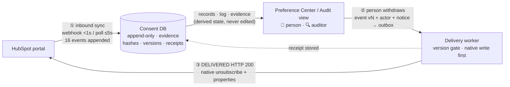
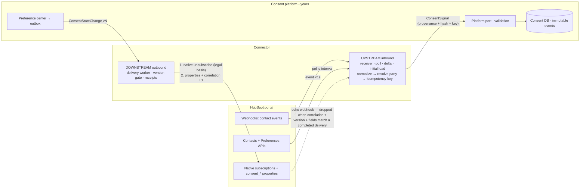
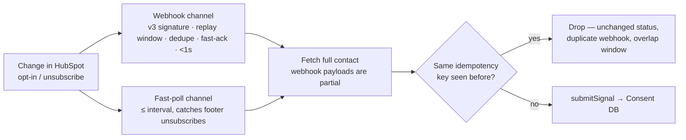
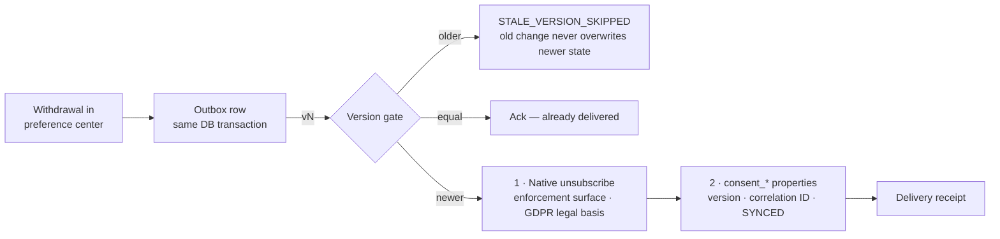

# Architecture & Flow

Rendered version with full diagrams: see the published artifact
("HubSpot Consent Connector — Architecture & Flow"). This file is the
repo-side reference.

## The closed loop (verified live)

Operating model: **HubSpot (inbound) → Consent DB / Preference Center → Downstream (HubSpot)**.

Verified end to end on Aug 10, 2026: inbound sync (16 events, 2s latency),
preference-center withdrawal (v3 with actor + notice version), downstream
delivery (HTTP 200, native status flipped), receipt in the consent DB, all
visible in the audit view (`scripts/build-audit-view.ts`).

## System overview

## Inbound: change in HubSpot → consent DB, immediately

Measured live: change at 23:46:22 → consent DB at 23:46:24 (**2 seconds**, 5s poll interval).

Whichever channel sees a change first wins; the shared deterministic key
(portal + contact + subscription type + status + timestamp) means the other
channel's sighting deduplicates — the consent DB receives each real change
**exactly once**. Delta sync (watermark + overlap) and reconciliation backstop
both channels, so a missed event is caught on the next sweep, never lost.

## Outbound: consent DB change → HubSpot, safely

Verified live: `WITHDRAWN v1 → DELIVERED (HTTP 200)`, native status flipped,
loop-prevention markers written.

Write order matters: the native subscription is the surface that actually
stops email — custom properties alone enforce nothing — so it is written first.
The properties then carry the correlation ID that the inbound echo-check uses.

## Key modules

| Flow step | Module |
|---|---|
| Webhook receiver + dedup + fast-ack | `src/ingestion/webhook-controller.ts` |
| Poll / delta / initial load | `src/ingestion/*-worker.ts`, `scripts/live-sync.ts` |
| Normalize → signal + idempotency key | `src/ingestion/normalizer.ts`, `pipeline.ts` |
| Platform boundary | `src/platform/port.ts` |
| Delivery worker + version gate + echo check | `src/delivery/hubspot-writer.ts` |
