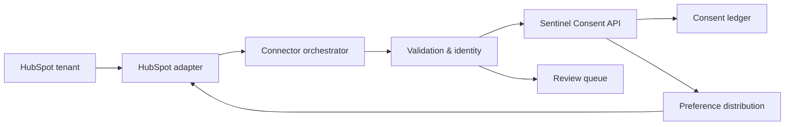
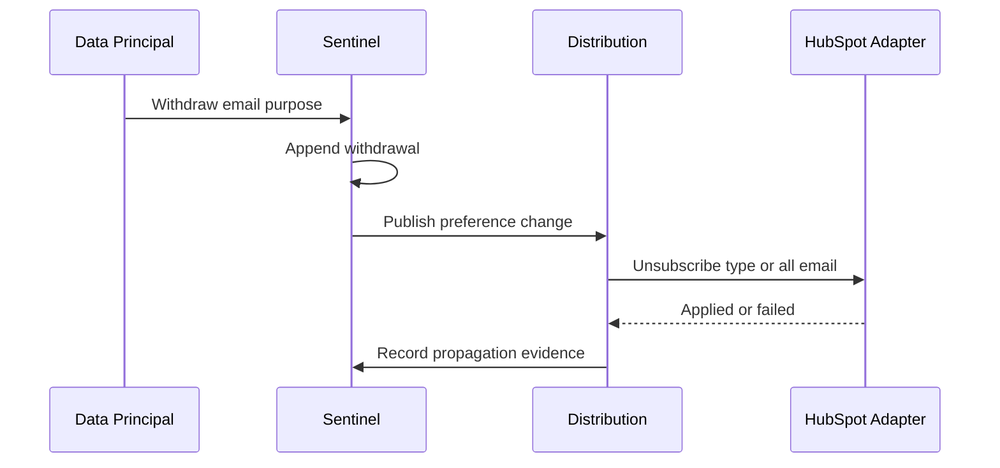

# HubSpot → Sentinel Consent Connector

## Architecture and API Specification

**Document version:** 1.0  
**Date:** 2026-08-03  
**Status:** Proposed  
**Owner:** Sentinel Privacy Platform Engineering  

## 1. Purpose

This specification defines a secure, auditable integration between HubSpot and Sentinel Consent Management. It covers contact and email-subscription preference ingestion, consent-evidence qualification, identity matching, withdrawal distribution, historical synchronization, reconciliation, security, auditability, and production acceptance.

Sentinel is the authoritative consent and preference ledger. HubSpot is a source of contact preferences and an enforcement destination for supported email subscription types. Form submissions, contact creation, list membership, page views, email delivery, opens, clicks, replies, meetings, calls, deals, and lifecycle-stage changes are not consent unless a separate explicit and versioned affirmative choice provides valid evidence.

Official implementation references:

- [HubSpot OAuth](https://developers.hubspot.com/docs/apps/legacy-apps/authentication/oauth-quickstart-guide)
- [HubSpot CRM Contacts API](https://developers.hubspot.com/docs/api-reference/crm-contacts-v3/guide)
- [HubSpot Communication Preferences API](https://developers.hubspot.com/docs/api-reference/legacy/communication-preferences/guide)
- [HubSpot Webhooks API](https://developers.hubspot.com/docs/api-reference/legacy/webhooks/guide)
- [HubSpot Forms API](https://developers.hubspot.com/docs/api-reference/marketing-forms-v3/guide)

Tenant entitlements, API versions, available scopes, Brands support, rate limits, and webhook capabilities must be confirmed during implementation.

## 2. Scope and authority model

In scope:

- OAuth 2.0 tenant authorization with minimum necessary scopes.
- Retrieval of HubSpot contacts and approved identity properties.
- Retrieval and mapping of email subscription-type definitions and statuses.
- Historical import, incremental polling, webhook-assisted change detection, and reconciliation.
- Explicit opt-in and opt-out evidence from approved forms or versioned contact properties.
- Brand-aware subscription mapping where HubSpot Brands is enabled.
- Sentinel-to-HubSpot email withdrawal and suppression writeback.
- Identity resolution, deduplication, quarantine, immutable history, and evidence hashes.

Out of scope:

- Inferring consent from CRM, marketing, sales, or engagement activity.
- Treating “marketing contact” status or list membership as consent.
- Assuming that clearing an opt-out creates a new consent grant.
- Treating opt-out as erasure or completion of a Data Principal request.
- Assuming the Communication Preferences API governs SMS, WhatsApp, calling, or custom channels.
- Ingesting email content, call recordings, meeting notes, files, or deal data by default.
- Browser scraping or undocumented HubSpot endpoints.

## 3. Roles and responsibilities

| Actor or system | Responsibility |
|---|---|
| Data Principal | Gives, refuses, changes, or withdraws a preference. |
| HubSpot Administrator | Installs the app, grants scopes, configures subscription types, forms, brands, and mappings. |
| Client Privacy Owner | Approves purposes, notices, legal bases, retention, and evidence rules. |
| HubSpot Adapter | Encapsulates OAuth, HubSpot APIs, pagination, limits, versions, and writeback. |
| Connector Orchestrator | Runs sync, webhook processing, retries, checkpoints, and reconciliation. |
| Identity Service | Resolves a HubSpot contact or subscriber to exactly one Sentinel Data Principal. |
| Validation Service | Qualifies consent evidence and distinguishes consent from operational state. |
| Sentinel Consent API | Appends immutable events and derives the current effective state. |
| Distribution Service | Applies withdrawals and approved preferences to HubSpot and other destinations. |
| Review Queue | Holds incomplete, ambiguous, conflicting, or unmapped records. |

## 4. Logical architecture



Use OAuth 2.0 authorization-code access for multi-tenant installations. Store secrets and refresh tokens only in an approved secrets manager. Use webhooks for eligible CRM changes, but retain polling and reconciliation because communication-preference changes may not be available through every webhook model.

## 5. Supported HubSpot data and treatment

| HubSpot data or event | Sentinel treatment |
|---|---|
| Contact ID and approved identity fields | Identity input; minimize and tokenize where possible. |
| Email subscription definition | Mapping input for purpose, brand, and communication category. |
| Subscription status: unsubscribed | Email-purpose withdrawal or suppression event. |
| Global email unsubscribe | Withdrawal/suppression for every mapped HubSpot email purpose. |
| Explicit subscription with complete proof | Consent candidate subject to evidence validation. |
| Form checkbox with versioned text and affirmative response | Consent candidate if form/version/context are retained. |
| Approved custom consent property | Candidate only through a versioned mapping profile. |
| Contact property change | Change signal only; retrieve authoritative state before processing. |
| Marketing-contact status | Commercial classification only; never consent. |
| Form submission without an explicit consent field | Operational submission only; never consent. |
| Page view, tracking-cookie event, email open/click | Engagement or tracking activity; never consent. |
| List/workflow enrollment, lifecycle stage, deal activity | CRM automation; never consent. |
| Logged SMS, WhatsApp, call, or LinkedIn communication | Engagement record; never channel consent. |

Consent, legitimate-interest assessment, email eligibility, suppression, cookie consent, channel preference, and Data Principal rights are separate concepts and records.

## 6. Consent qualification and precedence

A consent grant requires all of the following:

- Exactly one resolved Data Principal.
- A specific mapped purpose, channel, brand, and processing scope.
- An unambiguous affirmative action by the Data Principal or authorized representative.
- Consent statement text or an immutable statement hash.
- Privacy notice ID, version, language, and presentation context.
- Source timestamp, form/property source, and collection channel.
- HubSpot contact/subscriber reference and evidence integrity hash.
- A client-approved, versioned mapping profile.

An unsubscribe requires a reliable subscriber identity, subscription type or global scope, effective timestamp, source reference, and integrity evidence. Incomplete evidence may create a conservative suppression event, but must never create a consent grant.

Precedence rules:

1. Apply the most restrictive effective state immediately.
2. A valid newer withdrawal overrides an older grant.
3. An older HubSpot update cannot reverse a newer Sentinel withdrawal.
4. Clearing an opt-out field or changing contact status is not renewed consent.
5. A new grant after withdrawal requires fresh affirmative evidence.
6. Unknown ordering, identity collision, or mapping conflict enters quarantine.

## 7. Subscription and purpose mapping

Each HubSpot subscription type must map to one Sentinel purpose version.

| HubSpot concept | Sentinel mapping |
|---|---|
| Portal/account ID | Tenant connector configuration |
| Subscription type ID | Purpose/version mapping |
| Subscription name | Display metadata only; ID is authoritative |
| Brand/business unit ID | Brand or controller context |
| Subscriber email/contact ID | Data Principal identity input |
| Subscribed status | Grant candidate only with independent affirmative evidence |
| Unsubscribed status | Withdrawal/suppression for mapped purpose |
| Global unsubscribe | Withdraw/suppress all mapped email purposes |

Example mapping:

```json
{
  "mappingProfileId": "hubspot-map-us-01",
  "version": "1.0.0",
  "portalId": "1234567",
  "businessUnitId": "0",
  "subscriptionTypeId": "98765",
  "sentinelPurposeId": "PRODUCT_MARKETING_EMAIL",
  "sentinelPurposeVersion": "3.1",
  "channel": "EMAIL",
  "legalBasis": "CONSENT",
  "direction": "BIDIRECTIONAL"
}
```

Mapping changes are versioned and effective-dated. Never reinterpret historical evidence using a later mapping.

## 8. Adapter and Sentinel APIs

Sentinel-owned HubSpot adapter contract:

```http
GET   /adapter/v1/hubspot/capabilities
GET   /adapter/v1/hubspot/subscription-definitions?businessUnitId={id}
GET   /adapter/v1/hubspot/contacts?after={cursor}&updatedAfter={time}
GET   /adapter/v1/hubspot/contacts/{contactId}
GET   /adapter/v1/hubspot/subscription-statuses/{subscriberId}?channel=EMAIL
POST  /adapter/v1/hubspot/subscription-statuses/batch/read
POST  /adapter/v1/hubspot/subscriptions/subscribe
POST  /adapter/v1/hubspot/subscriptions/unsubscribe
POST  /adapter/v1/hubspot/subscriptions/unsubscribe-all
POST  /adapter/v1/hubspot/webhooks/verify
```

Public connector administration endpoints:

| Method and path | Purpose |
|---|---|
| `POST /api/v1/connectors/hubspot/configurations` | Create a tenant-scoped configuration. |
| `POST /api/v1/connectors/hubspot/configurations/{id}/authorize` | Begin OAuth authorization. |
| `GET /api/v1/connectors/hubspot/configurations/{id}/oauth/callback` | Complete OAuth with state validation. |
| `POST /api/v1/connectors/hubspot/configurations/{id}/test` | Test tenant, scopes, resources, brands, and write access. |
| `PUT /api/v1/connectors/hubspot/configurations/{id}/mappings` | Create a versioned subscription/purpose mapping. |
| `POST /api/v1/connectors/hubspot/configurations/{id}/sync` | Start historical or incremental synchronization. |
| `POST /api/v1/connectors/hubspot/configurations/{id}/reconcile` | Compare HubSpot and Sentinel effective states. |
| `POST /api/v1/connectors/hubspot/webhooks/{configurationId}` | Receive eligible tenant notifications. |
| `GET /api/v1/connectors/hubspot/jobs/{jobId}` | Return status and redacted failures. |
| `GET /api/v1/connectors/hubspot/quarantine` | List tenant-scoped exceptions. |

The adapter contract shields Sentinel from HubSpot API-version and entitlement differences. Actual API calls must use the tenant-supported documented version.

## 9. Canonical consent event

```json
{
  "schemaVersion": "1.0",
  "tenantId": "tenant_01J7",
  "externalConsentId": "hubspot:1234567:email:user@example.test:98765:20260803T201500Z",
  "idempotencyKey": "HUBSPOT:1234567:98765:sha256-...",
  "dataPrincipal": {
    "sentinelId": "dp_01J7",
    "sourceSubjectId": "contact-10492",
    "identityMatchMethod": "VERIFIED_EMAIL_HASH"
  },
  "source": {
    "system": "HUBSPOT",
    "portalId": "1234567",
    "businessUnitId": "0",
    "objectType": "EMAIL_SUBSCRIPTION_STATUS",
    "objectId": "contact-10492",
    "subscriptionTypeId": "98765"
  },
  "purpose": {
    "purposeId": "PRODUCT_MARKETING_EMAIL",
    "purposeVersion": "3.1",
    "legalBasis": "CONSENT"
  },
  "consent": {
    "status": "WITHDRAWN",
    "channel": "EMAIL",
    "occurredAt": "2026-08-03T20:15:00Z"
  },
  "evidence": {
    "method": "HUBSPOT_SUBSCRIPTION_UNSUBSCRIBE",
    "sourceReference": "hubspot:1234567:contact-10492:98765",
    "payloadHash": "sha256:..."
  },
  "mapping": {
    "profileId": "hubspot-map-us-01",
    "version": "1.0.0"
  }
}
```

For a grant, include affirmative-action details, statement/hash, notice ID/version, language, form ID/version or approved property provenance, collection page/context, and actor type.

## 10. Historical and incremental ingestion

1. Administrator authorizes Sentinel with approved scopes.
2. Sentinel validates the HubSpot portal, brands, API entitlements, and subscription definitions.
3. Privacy Owner approves subscription-to-purpose mappings.
4. Historical import pages through contacts or approved subscriber identifiers.
5. The connector retrieves authoritative email subscription status in supported batches.
6. Identity resolution produces exactly one match, no match, or quarantine.
7. Grants pass full evidence qualification; opt-outs create restrictive events.
8. Sentinel appends events using deterministic idempotency keys.
9. Incremental sync uses contact update signals, overlap windows, and status polling.
10. Scheduled reconciliation compares effective HubSpot and Sentinel states.

Checkpoint advancement occurs only after every item is accepted, deduplicated, or durably quarantined. A contact-property webhook is a notification, not consent evidence; retrieve and validate authoritative state before appending an event.

## 11. Form-based consent capture

For a HubSpot form to be an approved consent source, retain:

- Form ID and immutable form revision or deployment version.
- Exact checkbox/choice label and consent statement or hashes.
- Notice ID, version, language, and link presented.
- Purpose and subscription type mapping active at submission time.
- Affirmative value, submission timestamp, page/context, and source channel.
- HubSpot submission/contact reference and tamper-evident payload hash.
- Guardian or representative evidence when applicable.

Pre-checked boxes, bundled purposes, ambiguous language, mere form submission, or silent property defaults do not qualify as consent. If HubSpot does not retain enough presentation evidence, capture the evidence in Sentinel at collection time and use HubSpot only for downstream preference enforcement.

## 12. Withdrawal distribution and loop prevention



Distribution results are `APPLIED`, `ALREADY_APPLIED`, `FAILED_RETRYABLE`, `FAILED_PERMANENT`, or `NOT_SUPPORTED`. Apply global withdrawals to all mapped email purposes. Use origin IDs and event fingerprints so HubSpot writeback events are recognized and do not create loops.

The connector must not subscribe a person in HubSpot solely because Sentinel lacks a withdrawal. A subscribe write requires a current Sentinel grant with complete evidence and a mapping explicitly authorized for writeback.

## 13. Authentication and security

- Request only required OAuth scopes, normally contact read plus communication-preference read; add write only for approved distribution.
- Use the current supported communication-preference scopes and separately gate enterprise batch scopes by entitlement.
- Validate OAuth `state`, exact redirect URI, PKCE where supported, and the authorized portal identity.
- Encrypt refresh tokens with tenant-scoped keys; rotate and revoke on disconnect.
- Validate supported HubSpot webhook signatures using the raw request and reject replay outside the approved tolerance.
- Use TLS 1.2+; use private connectivity or mTLS for Sentinel internal hops where required.
- Enforce tenant isolation in authorization, queues, storage, encryption context, metrics, and jobs.
- Never log tokens, raw email addresses, message content, form free text, or full webhook payloads.
- Hash or tokenize email/phone identifiers where feasible; retain direct identifiers only where required for HubSpot calls.
- Keep append-only consent history, evidence hashes, mapping versions, and distribution receipts.
- Apply approved retention, purpose limitation, access control, deletion, legal hold, and data-residency rules.

## 14. Error handling and observability

| Condition | Handling |
|---|---|
| Rate limit or temporary outage | Honor retry guidance; exponential backoff with jitter; retain checkpoint. |
| Expired token | Refresh once; fail closed and alert if unsuccessful. |
| Missing scope or entitlement | Disable the affected capability and alert the administrator. |
| Duplicate event | Return the existing result through idempotency. |
| Missing grant evidence | Quarantine; never create a consent grant. |
| Ambiguous identity or duplicate contacts | Quarantine; never auto-merge Data Principals. |
| Unknown subscription type/brand | Quarantine until an approved mapping exists. |
| Permanent writeback failure | Preserve Sentinel state, alert, and expose remediation status. |
| Unsupported channel | Mark `NOT_SUPPORTED`; route through the approved channel system. |

Monitor sync lag, status-poll age, webhook failures, queue depth, quarantine rate, reconciliation drift, withdrawal-propagation latency, token failures, scope drift, rate limiting, and retry exhaustion without exposing personal data.

## 15. Reconciliation rules

Reconciliation compares each mapped email purpose and classifies:

- `MATCH`: HubSpot and Sentinel effective states agree.
- `HUBSPOT_MORE_RESTRICTIVE`: import the opt-out and investigate provenance.
- `SENTINEL_MORE_RESTRICTIVE`: push unsubscribe and record evidence.
- `MISSING_IN_HUBSPOT`: do not auto-create or subscribe without policy approval.
- `UNKNOWN_MAPPING`: quarantine.
- `IDENTITY_CONFLICT`: quarantine.

Withdrawals are automatically enforced. Grants are not automatically reconstructed from HubSpot status alone. Reconciliation output includes portal, brand, mapping version, counts, age, remediation result, and redacted exception references.

## 16. DPDP and privacy controls

The connector must preserve:

- Specific purpose and understandable notice.
- Language and notice version shown at collection.
- Clear affirmative action and collection channel.
- Data Principal or verified representative identity.
- Date/time, source, and tamper-evident proof.
- Withdrawal that is as easy as giving consent.
- Immediate downstream suppression with traceable propagation.
- Complete consent history without silently deleting audit evidence.
- Data minimization, purpose limitation, retention, and access controls.
- Separation of marketing opt-out, consent withdrawal, cookie preference, and rights-request workflows.

The client remains responsible for determining when consent is the appropriate legal basis and whether each HubSpot form, property, subscription type, and workflow is legally and operationally valid.

## 17. Verification matrix

| Test | Expected result |
|---|---|
| OAuth success and state mismatch | Correct portal authorized; invalid callback rejected. |
| Minimum-scope installation | Read works; unapproved write operations are unavailable. |
| Subscription definitions and Brands | IDs map to the correct tenant, brand, and Sentinel purpose version. |
| Historical import restart | No loss or duplication after checkpoint recovery. |
| Explicit form opt-in with complete proof | One idempotent grant event is created. |
| Form submit without consent checkbox | No grant is created. |
| Marketing-contact or list enrollment | No consent event is created. |
| Subscription-specific unsubscribe | Only the mapped email purpose is withdrawn. |
| Global email unsubscribe | Every mapped HubSpot email purpose is suppressed. |
| Clearing an opt-out | No renewed grant without fresh affirmative proof. |
| Sentinel withdrawal writeback | HubSpot is unsubscribed and a receipt is stored. |
| Writeback echo | Event is deduplicated; no processing loop. |
| Duplicate/ambiguous identity | Record is quarantined without auto-merge. |
| Rate limit and token expiry | Safe retry/refresh occurs without checkpoint loss. |
| Unsupported SMS/WhatsApp preference | No false email mapping; status is `NOT_SUPPORTED`. |
| Reconciliation drift | Restrictive state is restored and remediation is audited. |
| Tenant-isolation test | Cross-portal access is denied and logged. |

## 18. Responsibility matrix

| Responsibility | Client | Sentinel vendor |
|---|---:|---:|
| Approve purposes, notices, legal basis, and retention | Accountable | Support |
| Create/configure HubSpot app and authorize portal access | Accountable | Support |
| Configure forms, subscription types, brands, and workflows | Accountable | Guidance |
| Build and operate connector/adapter | Review | Accountable |
| Approve subscription-to-purpose mapping | Accountable | Implement |
| Maintain authoritative ledger and evidence | — | Accountable |
| Configure downstream suppression beyond HubSpot email | Accountable | Integration support |
| Review quarantine and identity conflicts | Shared | Shared |
| Monitor reconciliation and propagation | Shared | Shared |

## 19. Delivery phases

1. **Discovery:** Confirm portal topology, HubSpot tier, brands, scopes, subscription definitions, forms, properties, volumes, rate limits, and preference ownership.
2. **Read-only pilot:** OAuth, definitions, contacts, email-status ingestion, mapping, identity resolution, quarantine, and audit.
3. **Evidence enablement:** Approve form/property evidence templates and validate notice/purpose versioning.
4. **Writeback:** Enable Sentinel withdrawals to HubSpot for approved email subscription types.
5. **Production hardening:** Reconciliation, alerts, dashboards, runbooks, recovery tests, security review, and privacy sign-off.

## 20. Production acceptance criteria

- No consent is inferred from contact, marketing, sales, form-submission, or engagement activity.
- Every grant contains purpose, notice, affirmative-action, timestamp, source, identity, and evidence integrity data.
- Every mapped email withdrawal reaches Sentinel and approved writeback reaches HubSpot within the agreed SLA.
- Historical and incremental jobs are restartable and idempotent.
- Webhook and polling paths recover from missed, duplicate, delayed, and out-of-order events.
- Global and subscription-specific email opt-outs are enforced correctly.
- SMS, WhatsApp, calling, and custom channels are not falsely represented as covered by the email preference API.
- Tenant isolation, OAuth security, secret handling, audit logging, and privacy controls pass review.
- Reconciliation identifies and remediates restrictive-state drift.
- Runbooks, RACI, mapping register, retention policy, and rollback procedure are approved.

## 21. Required implementation inputs

- HubSpot portal IDs, environments, account tier, and Brands configuration.
- Approved OAuth app type, redirect URIs, scopes, and administrators.
- Subscription definitions and business-unit IDs.
- Forms/properties proposed as explicit consent sources, including exact text and notice versions.
- Identity keys, duplicate-contact rules, and Data Principal matching policy.
- Sentinel purpose catalog and consent-ingestion API contract.
- Preference-system-of-record decision for each channel.
- Historical volume, change rate, SLA, retention, residency, and reconciliation frequency.
- Approved downstream enforcement path for SMS, WhatsApp, calling, and channels not supported by HubSpot email preferences.

