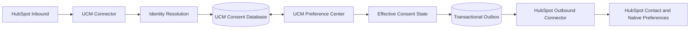
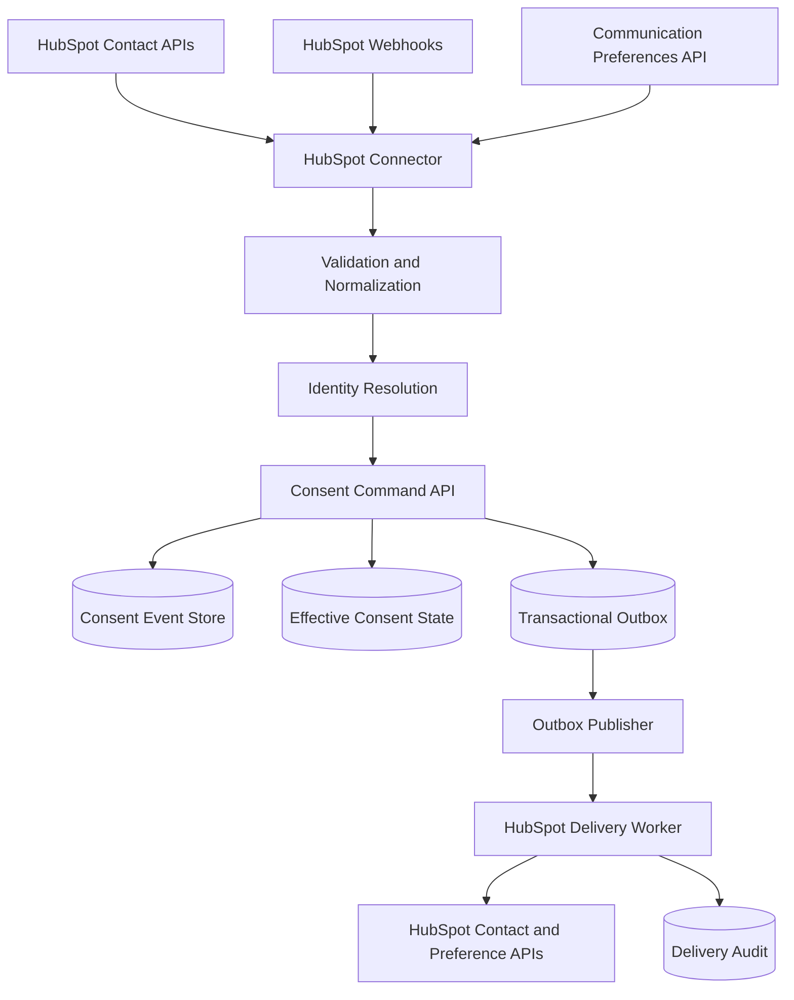
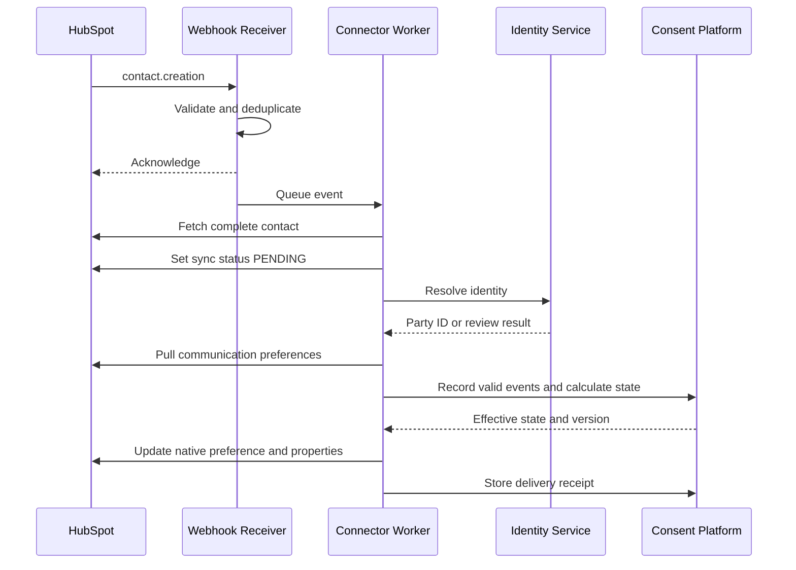
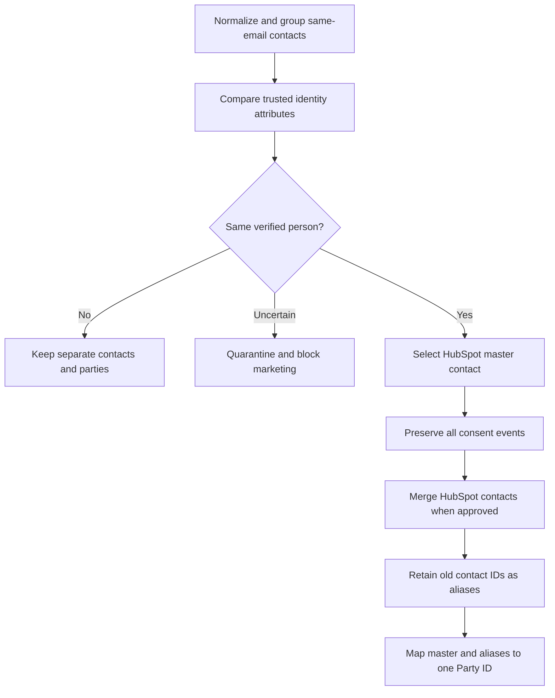

# HubSpot Consent Connector

## Implementation Handoff for Claude Code or Codex

**Status:** Implementation-ready specification  
**Scope:** HubSpot ↔ Unified Consent Platform  
**Direction:** Bidirectional  
**Primary pattern:** HubSpot webhook and delta pull → connector → consent service → transactional outbox → HubSpot update  

---

## 1. Objective

Build a production-grade HubSpot connector that:

1. Authenticates to one or more HubSpot accounts.
2. Performs an initial full pull of contacts and configured properties.
3. Pulls HubSpot native email communication preferences.
4. Receives contact creation, property-change, merge, deletion and privacy-deletion events.
5. Runs incremental and scheduled reconciliation pulls to recover missed events.
6. Resolves HubSpot contacts to canonical parties without treating email as a guaranteed unique identity.
7. Imports only valid consent evidence; missing or ambiguous data remains `UNKNOWN`.
8. Pushes effective consent and communication preferences back to HubSpot.
9. Prevents marketing communication while consent resolution is pending or the contact is ineligible.
10. Handles duplicate HubSpot contacts safely.
11. Prevents event loops, stale overwrites and duplicate processing.
12. Produces complete audit and delivery records.

---

## 1.1 Mandatory Closed-Loop Direction

The connector must implement this exact bidirectional operating model:

```text
HubSpot (Inbound)
    → UCM Connector Ingestion
    → UCM Identity Resolution
    → UCM Consent Database
    → UCM Preference Center
    → UCM Effective Consent State
    → UCM Transactional Outbox
    → HubSpot Connector Delivery
    → HubSpot (Outbound)
```



This is not an inbound-only data-import connector. Both paths are mandatory:

### Inbound path: HubSpot → UCM

The connector must pull or receive:

- contact creation and changes;
- contact merges and deletions;
- identity attributes required for matching;
- configured custom consent properties;
- HubSpot native communication-subscription preferences;
- source timestamps and identifiers required for audit and idempotency.

The UCM platform must normalize the data, resolve the party, validate whether a source value qualifies as consent evidence, append valid events to the consent database, and expose the effective state through the UCM Preference Center.

### Preference Center path: UCM user action

When a person grants, changes or withdraws a preference in the UCM Preference Center:

1. The Preference Center sends a consent command to the UCM Consent API.
2. The Consent API validates party, purpose, channel, brand, jurisdiction, notice version and evidence.
3. UCM appends an immutable consent event.
4. UCM calculates the new effective consent state and increments `consentVersion`.
5. UCM writes a `CONSENT_STATE_CHANGED` record into the transactional outbox in the same transaction.
6. The outbox publisher sends the event to the HubSpot outbound delivery worker.
7. The worker finds the mapped HubSpot contact using portal ID and contact ID or the verified external mapping.
8. The worker updates HubSpot custom consent properties.
9. For email preferences, the worker also updates HubSpot's native communication-subscription status.
10. UCM records the delivery result and retry state.

### Outbound path: UCM → HubSpot

Outbound must cover at least:

- grant, when legally valid and supported;
- withdrawal;
- purpose-specific preference change;
- channel-specific preference change;
- consent expiration where applicable;
- party-to-HubSpot contact mapping;
- latest consent version;
- effective timestamp;
- synchronization status;
- native HubSpot email subscription status;
- delivery audit and failure handling.

### Closed-loop success condition

A change is complete only when:

```text
UCM consent event committed
AND effective state calculated
AND outbox event published
AND HubSpot update delivered or placed in a controlled retry/review state
AND delivery receipt stored
```

If HubSpot is temporarily unavailable, the consent change remains valid in UCM and outbound delivery is retried. HubSpot unavailability must never roll back or discard the person's UCM withdrawal.

---

## 2. Core Rules

- The consent platform is the consent system of record.
- HubSpot may capture and consume consent but does not own the canonical event history.
- Email is a matching attribute, not a primary key for a person.
- The HubSpot source key is `portal ID + object type + contact ID`.
- Every consent grant or withdrawal is stored as an immutable event.
- Missing, blank or ambiguous consent never becomes `GRANTED`.
- A valid withdrawal must not be overwritten by an older grant.
- Webhook delivery is treated as at least once; all processing must be idempotent.
- Connector writes must include a consent version and origin marker to prevent loops.
- HubSpot native email subscription status must be synchronized; custom properties alone are insufficient for email enforcement.
- A newly created contact remains ineligible for marketing until consent evaluation completes.

---

## 3. Architecture



### Components

| Component | Responsibility |
|---|---|
| OAuth service | Installation, token exchange, refresh and revocation handling |
| Webhook receiver | Signature validation, replay protection and fast acknowledgement |
| Initial-load worker | Paginated full contact extraction |
| Delta-sync worker | Pulls contacts modified after a watermark |
| Preference reader | Retrieves native email subscription status |
| Normalizer | Maps HubSpot properties into canonical fields |
| Identity resolver | Links a HubSpot contact to a canonical party |
| Consent service | Validates and appends consent events |
| State projector | Calculates current consent by scope |
| Transactional outbox | Guarantees downstream delivery after commit |
| HubSpot writer | Updates CRM properties and native communication preferences |
| Reconciliation worker | Detects and repairs drift |
| Audit service | Stores evidence, decisions and delivery outcomes |

---

## 4. Authentication and Installation

### 4.1 Application type

| Deployment | Recommended authentication |
|---|---|
| One known HubSpot account | Private application token |
| SaaS connector installed by multiple customers | OAuth application |

Use OAuth for the productized multi-tenant connector.

### 4.2 Required scopes

Request only scopes needed by enabled capabilities. At minimum, evaluate:

```text
crm.objects.contacts.read
crm.objects.contacts.write
```

Also request the current HubSpot scopes required to read and update communication preferences and configure/consume the chosen webhook model.

Do not hard-code assumptions about scopes. Validate granted scopes after installation and expose missing capabilities in connector health.

### 4.3 OAuth lifecycle

1. Administrator initiates installation.
2. Redirect administrator to HubSpot authorization URL with `state` and PKCE where supported by the selected application model.
3. Validate returned `state`.
4. Exchange authorization code for access and refresh tokens.
5. Encrypt tokens using tenant-specific encryption context.
6. Cache the short-lived access token.
7. Refresh before expiration or after an authorized `401` response.
8. Mark connector `AUTHORIZATION_REQUIRED` if refresh is revoked or invalid.
9. Remove or disable credentials when the application is uninstalled.

Official documentation: [HubSpot OAuth](https://developers.hubspot.com/docs/api-reference/latest/authentication/manage-oauth-tokens)

### 4.4 Secret handling

- Store client secret and refresh tokens in a secrets manager.
- Never log access tokens, authorization codes or webhook secrets.
- Encrypt secrets at rest and use TLS in transit.
- Separate tokens by customer tenant and HubSpot portal.
- Support credential rotation.

---

## 5. Connector Configuration

```yaml
connectorId: CONN-HUBSPOT-001
tenantId: TENANT-100
type: HUBSPOT
hubspotPortalId: "987654"
enabled: true
direction:
  inbound: true
  outbound: true
authentication:
  type: OAUTH
  secretReference: secrets/hubspot/tenant-100
identity:
  matchingPolicy: STRICT
  partyIdProperty: consent_party_id
  enterpriseCustomerIdProperty: external_customer_id
sync:
  webhooksEnabled: true
  deltaPullEnabled: true
  reconciliationSchedule: "0 2 * * *"
  overlapMinutes: 5
  pageSize: 100
provisioning:
  createMissingContacts: false
enforcement:
  pendingStatus: DO_NOT_SEND
  unknownStatus: DO_NOT_SEND
  unavailablePolicy: FAIL_CLOSED
fieldMappings:
  email: email
  firstName: firstname
  lastName: lastname
  phone: phone
  partyId: consent_party_id
  consentSyncStatus: consent_sync_status
  consentVersion: consent_version
  consentUpdatedAt: consent_last_updated
purposeMappings:
  MARKETING_INFORMATION: EMAIL_MARKETING
  PRODUCT_UPDATES: PRODUCT_UPDATES
```

Secrets must be referenced, never embedded.

---

## 6. Recommended HubSpot Custom Properties

Create only the properties required for routing, visibility and reconciliation:

| Property | Type | Purpose |
|---|---|---|
| `consent_party_id` | Unique text when feasible | Canonical party identifier |
| `consent_sync_status` | Enumeration | `PENDING`, `SYNCED`, `REVIEW_REQUIRED`, `ERROR` |
| `consent_version` | Number | Last consent version applied |
| `consent_last_updated` | Datetime | Effective consent update time |
| `consent_source` | Text/enumeration | Origin system |
| `email_marketing_status` | Enumeration | Effective email marketing state for visibility |
| `product_update_status` | Enumeration | Product-update preference for visibility |
| `consent_correlation_id` | Text | Loop-prevention and audit correlation |
| `consent_updated_by` | Enumeration | `CONSENT_PLATFORM`, `HUBSPOT`, `USER`, etc. |

Do not use a custom property as the only control for HubSpot marketing email. Also update the native communication subscription state.

---

## 7. Canonical Data Model

### 7.1 External identity mapping

```json
{
  "tenantId": "TENANT-100",
  "partyId": "PARTY-9001",
  "sourceSystem": "HUBSPOT",
  "sourceTenantId": "987654",
  "sourceObjectType": "CONTACT",
  "sourceRecordId": "123456",
  "mappingStatus": "VERIFIED",
  "matchMethod": "ENTERPRISE_CUSTOMER_ID",
  "sourceUpdatedAt": "2026-08-10T14:25:00Z",
  "firstSeenAt": "2026-08-01T10:00:00Z",
  "lastSeenAt": "2026-08-10T14:25:00Z"
}
```

Database constraint:

```sql
UNIQUE (
  tenant_id,
  source_system,
  source_tenant_id,
  source_object_type,
  source_record_id
)
```

### 7.2 Consent event

```json
{
  "eventId": "CEVT-100045",
  "tenantId": "TENANT-100",
  "partyId": "PARTY-9001",
  "eventType": "WITHDRAWN",
  "purposeCode": "EMAIL_MARKETING",
  "channel": "EMAIL",
  "brandCode": "BRAND-A",
  "jurisdiction": "IN",
  "status": "WITHDRAWN",
  "effectiveAt": "2026-08-10T14:30:00Z",
  "capturedAt": "2026-08-10T14:30:00Z",
  "captureChannel": "HUBSPOT",
  "noticeVersion": "marketing-notice-v4",
  "evidenceReference": "EVID-2345",
  "sourceRecordId": "123456",
  "sourceEventId": "hubspot-event-789",
  "consentVersion": 17,
  "recordedAt": "2026-08-10T14:30:01Z"
}
```

### 7.3 Effective consent state

Key:

```text
tenant + party + brand + purpose + channel + jurisdiction
```

```json
{
  "partyId": "PARTY-9001",
  "brandCode": "BRAND-A",
  "purposeCode": "EMAIL_MARKETING",
  "channel": "EMAIL",
  "jurisdiction": "IN",
  "effectiveStatus": "WITHDRAWN",
  "consentVersion": 17,
  "effectiveAt": "2026-08-10T14:30:00Z",
  "derivedFromEventId": "CEVT-100045"
}
```

### 7.4 Delivery receipt

```json
{
  "deliveryId": "DEL-1001",
  "eventId": "CEVT-100045",
  "destinationSystem": "HUBSPOT",
  "destinationTenantId": "987654",
  "destinationRecordId": "123456",
  "consentVersion": 17,
  "status": "DELIVERED",
  "attemptCount": 1,
  "deliveredAt": "2026-08-10T14:30:04Z",
  "responseCode": 200
}
```

---

## 8. Initial Full Pull

### 8.1 Contacts request

```http
GET https://api.hubapi.com/crm/v3/objects/contacts
    ?limit=100
    &properties=email,firstname,lastname,phone,hs_object_id,
                hs_createdate,hs_lastmodifieddate,
                consent_party_id,external_customer_id,
                consent_sync_status,consent_version,
                consent_last_updated
Authorization: Bearer {ACCESS_TOKEN}
Accept: application/json
```

Official documentation: [HubSpot Contacts API](https://developers.hubspot.com/docs/api-reference/latest/crm/objects/contacts/guide)

### 8.2 Pagination

1. Start without `after`.
2. Process the returned page transactionally.
3. Read `paging.next.after`.
4. Request the next page with that cursor.
5. Stop when `paging.next` is absent.
6. Store page-level progress so the job can resume safely.

Do not advance the durable cursor until the current page has been normalized, stored and queued for required follow-up work.

### 8.3 Python example

```python
from collections.abc import Iterator
import requests


class HubSpotClient:
    def __init__(self, access_token: str):
        self.base_url = "https://api.hubapi.com"
        self.headers = {
            "Authorization": f"Bearer {access_token}",
            "Accept": "application/json",
        }

    def iter_contacts(self) -> Iterator[dict]:
        url = f"{self.base_url}/crm/v3/objects/contacts"
        params = {
            "limit": 100,
            "properties": ",".join([
                "email",
                "firstname",
                "lastname",
                "phone",
                "hs_object_id",
                "hs_createdate",
                "hs_lastmodifieddate",
                "consent_party_id",
                "external_customer_id",
                "consent_sync_status",
                "consent_version",
                "consent_last_updated",
            ]),
        }

        while True:
            response = requests.get(
                url,
                headers=self.headers,
                params=params,
                timeout=30,
            )
            response.raise_for_status()
            page = response.json()

            yield from page.get("results", [])

            next_page = page.get("paging", {}).get("next")
            if not next_page:
                break

            params["after"] = next_page["after"]
```

Production code must add token refresh, rate-limit handling, retries with jitter, metrics and structured redacted logging.

---

## 9. Pull Native Communication Preferences

Use HubSpot's communication-preferences API to read the subscription statuses associated with the contact's email address:

```http
GET /communication-preferences/v3/status/email/{emailAddress}
Authorization: Bearer {ACCESS_TOKEN}
Accept: application/json
```

Official documentation: [HubSpot Communication Preferences](https://developers.hubspot.com/docs/api-reference/legacy/communication-preferences/v3/guide)

### Mapping example

| HubSpot subscription type | Canonical purpose |
|---|---|
| Marketing information | `EMAIL_MARKETING` |
| Product updates | `PRODUCT_UPDATES` |
| Events | `EVENT_MARKETING` |
| Customer service | `SERVICE_COMMUNICATION` |

Mappings must be configured per tenant. Do not assume that every subscription type represents consent; the business must classify its applicable lawful basis and message type.

### Import evidence rule

A subscription status becomes a canonical consent event only when required evidence is available or the approved import policy permits the source as authoritative. At minimum assess:

- subscription type/purpose;
- subscribed or unsubscribed state;
- event timestamp;
- capture source;
- notice or policy version when required;
- affirmative action or other supported legal basis;
- brand/business unit;
- jurisdiction.

If evidence is insufficient:

```text
effective_status = UNKNOWN
review_reason = INSUFFICIENT_SOURCE_EVIDENCE
```

---

## 10. Incremental Pull

Use `hs_lastmodifieddate` through the CRM Search API.

```http
POST https://api.hubapi.com/crm/v3/objects/contacts/search
Authorization: Bearer {ACCESS_TOKEN}
Content-Type: application/json
```

```json
{
  "filterGroups": [
    {
      "filters": [
        {
          "propertyName": "hs_lastmodifieddate",
          "operator": "GT",
          "value": "1786370400000"
        }
      ]
    }
  ],
  "sorts": ["hs_lastmodifieddate"],
  "properties": [
    "email",
    "firstname",
    "lastname",
    "phone",
    "hs_lastmodifieddate",
    "consent_party_id",
    "external_customer_id",
    "consent_sync_status",
    "consent_version"
  ],
  "limit": 200
}
```

Official documentation: [HubSpot CRM Search](https://developers.hubspot.com/docs/api-reference/latest/crm/search-the-crm)

### Watermark policy

```text
query_from = last_successful_watermark - overlap_window
```

Recommended overlap: five minutes, configurable by tenant. The overlap prevents boundary loss; idempotency prevents duplicate consent events.

Advance the watermark only after all returned pages have been committed successfully. Store the maximum observed source modification time, not local job start time.

---

## 11. Webhooks

Subscribe to applicable contact events:

```text
contact.creation
contact.propertyChange
contact.merge
contact.deletion
contact.privacyDeletion
```

Official documentation: [HubSpot Webhooks](https://developers.hubspot.com/docs/api-reference/latest/webhooks/guide)

### Webhook receiver flow

1. Read the raw request body.
2. Validate the current HubSpot signature algorithm and timestamp according to HubSpot documentation.
3. Reject requests outside the replay window.
4. Deduplicate by portal, application, subscription, object and event identifiers.
5. Persist the raw-event reference or sanitized event envelope.
6. Enqueue processing.
7. Return success quickly; do not perform full synchronization in the HTTP request.
8. Worker fetches the current complete contact because webhook payloads may be partial.

### Event idempotency key

```text
tenant + hubspot portal + subscription/event type + source event ID
```

If a stable source event ID is not available, derive a deterministic key from the documented event identifiers and occurrence time, and retain delta reconciliation as the recovery mechanism.

---

## 12. New Contact Scenario



### Detailed rules

1. Contact creation is detected.
2. Mark `consent_sync_status=PENDING` when custom properties are used.
3. HubSpot marketing workflows and lists must exclude contacts with `PENDING`, `UNKNOWN`, `WITHDRAWN`, `REVIEW_REQUIRED` or `ERROR`.
4. Resolve identity using trusted identifiers.
5. Pull native email preferences.
6. Create consent events only when evidence is valid.
7. Calculate current consent.
8. Update HubSpot native subscription state and custom visibility fields.
9. Mark `consent_sync_status=SYNCED` only after the required HubSpot writes succeed.

This prevents the race where a contact is created and immediately enrolled in a marketing workflow before consent evaluation.

---

## 13. Identity Resolution

### Matching hierarchy

1. Existing `consent_party_id`.
2. Verified `external_customer_id` or enterprise party ID.
3. Another configured stable, verified identifier.
4. Verified email combined with another attribute.
5. Verified phone combined with another attribute.
6. Email-only match becomes a possible-duplicate group.

### Outcomes

| Outcome | Action |
|---|---|
| Exact trusted identifier match | Link automatically |
| One approved strong match | Link and audit matching rule |
| No match | Create a new party with consent `UNKNOWN` unless valid evidence exists |
| Multiple candidates | Set `REVIEW_REQUIRED` and block marketing |
| Conflicting trusted IDs | Stop processing with `IDENTITY_CONFLICT` |
| Shared email | Keep separate parties |

---

## 14. Five HubSpot Contacts with the Same Email

Five matching emails are potential duplicates, not proof of one person.



### Compare

- external customer ID;
- first and last name;
- verified phone;
- account/company association;
- address when necessary and permitted;
- lifecycle stage;
- owner and business unit;
- lists, workflows, deals, tickets and engagement associations;
- record creation and verification timestamps.

### Master selection

1. Verified enterprise/customer identifier.
2. Active and authoritative contact.
3. Most complete verified data.
4. Required CRM relationships.
5. Most recently verified record.

Do not select the newest record automatically.

### Consent handling during merge

- Do not retain only the master's visible consent properties.
- Preserve consent events from all verified duplicates.
- Evaluate them by purpose, channel, brand and jurisdiction.
- Reject stale versions.
- Retain withdrawal evidence.
- Never infer a grant from blank fields.

### Alias table

```text
HubSpot 123452 → HubSpot 123456 → PARTY-9001
HubSpot 123453 → HubSpot 123456 → PARTY-9001
HubSpot 123454 → HubSpot 123456 → PARTY-9001
HubSpot 123455 → HubSpot 123456 → PARTY-9001
```

Delayed events containing retired IDs must resolve to the master rather than create another party.

---

## 15. Push Consent Back to HubSpot

### 15.1 CRM property update

Update an existing contact by HubSpot contact ID:

```http
PATCH /crm/v3/objects/contacts/{contactId}
Authorization: Bearer {ACCESS_TOKEN}
Content-Type: application/json
```

```json
{
  "properties": {
    "consent_party_id": "PARTY-9001",
    "consent_sync_status": "SYNCED",
    "email_marketing_status": "WITHDRAWN",
    "consent_version": "17",
    "consent_last_updated": "2026-08-10T14:30:00Z",
    "consent_source": "CONSENT_PLATFORM",
    "consent_correlation_id": "CORR-123",
    "consent_updated_by": "CONSENT_PLATFORM"
  }
}
```

### 15.2 Native communication preference update

Use the current HubSpot communication-preferences API to subscribe or unsubscribe the email address from the mapped subscription type.

Rules:

- Use tenant-configured mapping between canonical purposes and HubSpot subscription types.
- Do not opt a person back in merely because another CRM property says granted.
- Require a valid newer canonical consent version.
- Treat an all-email opt-out carefully; do not attempt an unsupported or legally invalid reversal.
- Store the HubSpot response and applied version.

### 15.3 Upsert and provisioning

By default, do not create missing HubSpot contacts. If contact provisioning is explicitly enabled:

- prefer a custom unique identifier such as `consent_party_id`;
- use HubSpot batch upsert when appropriate;
- use email cautiously because partial upsert by email has limitations;
- never create a second contact when a trusted mapping already exists;
- quarantine ambiguous results.

Official documentation: [HubSpot Contacts API](https://developers.hubspot.com/docs/api-reference/latest/crm/objects/contacts/guide)

---

## 16. Transactional Outbox

When a consent event is committed, create the destination event in the same database transaction.

```json
{
  "eventId": "EVT-1001",
  "eventType": "CONSENT_STATE_CHANGED",
  "tenantId": "TENANT-100",
  "partyId": "PARTY-9001",
  "consentVersion": 17,
  "scope": {
    "brandCode": "BRAND-A",
    "purposeCode": "EMAIL_MARKETING",
    "channel": "EMAIL",
    "jurisdiction": "IN"
  },
  "effectiveStatus": "WITHDRAWN",
  "effectiveAt": "2026-08-10T14:30:00Z",
  "originSystem": "HUBSPOT",
  "correlationId": "CORR-123"
}
```

Destination idempotency key:

```text
tenant + HUBSPOT + portal + party + consent scope + consent version
```

### Version rules

- greater than last applied: apply;
- equal to last applied: acknowledge and skip;
- lower than last applied: mark `STALE_VERSION_SKIPPED`;
- version gap: retrieve current canonical state before applying.

---

## 17. Loop Prevention

Bidirectional updates can echo indefinitely without origin tracking.

Write:

```text
consent_version
consent_source
consent_updated_by
consent_correlation_id
```

Inbound processing may skip a property-change event only when:

1. the event matches a completed outbound correlation ID;
2. the version equals the version already delivered; and
3. the changed fields match the connector's write.

Do not ignore every event created by the integration user. A human or workflow may create a material new change.

---

## 18. Eligibility API

For final pre-send protection, expose a synchronous decision endpoint.

```http
POST /consent/v1/eligibility/check
Authorization: Bearer {SERVICE_TOKEN}
Content-Type: application/json
Idempotency-Key: {REQUEST_ID}
```

```json
{
  "tenantId": "TENANT-100",
  "partyId": "PARTY-9001",
  "channel": "EMAIL",
  "purposeCode": "EMAIL_MARKETING",
  "brandCode": "BRAND-A",
  "jurisdiction": "IN"
}
```

```json
{
  "eligible": false,
  "reasonCode": "CONSENT_WITHDRAWN",
  "effectiveStatus": "WITHDRAWN",
  "consentVersion": 17,
  "decisionId": "DEC-7001"
}
```

Marketing processing should fail closed or remain queued when the eligibility decision is unavailable.

---

## 19. Reconciliation

Run scheduled reconciliation even when webhooks are healthy.

1. Pull contacts modified since the last watermark using an overlap window.
2. Normalize and compare source hashes.
3. Reprocess changed records.
4. Pull relevant native communication preferences.
5. Compare HubSpot state to canonical effective consent.
6. Repair deterministic drift.
7. Quarantine identity or evidence conflicts.
8. Produce a report.
9. Advance the watermark only after successful completion.

Also schedule a controlled periodic full comparison when necessary to detect missed deletions or long-term drift.

---

## 20. Error Handling

### Retryable

- `429` rate limiting;
- temporary `5xx`;
- timeout or transient network failure;
- expired access token when refresh remains valid;
- temporary HubSpot unavailability.

Use exponential backoff with jitter and honor `Retry-After`.

### Manual action or permanent failure

- revoked refresh token;
- missing scope;
- webhook signature failure;
- ambiguous identity;
- conflicting trusted IDs;
- invalid property mapping;
- deleted contact;
- insufficient consent evidence;
- malformed tenant configuration.

### Delivery statuses

```text
DELIVERED
CONTACT_NOT_FOUND
RETRYABLE_FAILURE
PERMANENT_FAILURE
STALE_VERSION_SKIPPED
REVIEW_REQUIRED
```

Repeated failures must move to a dead-letter queue with a controlled replay operation.

---

## 21. Security

1. Use least-privilege scopes.
2. Encrypt OAuth tokens and connector credentials.
3. Validate webhook signatures and timestamps.
4. Implement replay protection.
5. Redact emails, tokens and sensitive fields from logs.
6. Isolate tenants in storage, queues and caches.
7. Authenticate internal service calls.
8. Rate-limit inbound endpoints.
9. Keep immutable consent and administrative audit logs.
10. Rotate keys and revoke credentials when connectors are disabled.
11. Do not store full webhook payloads indefinitely without a retention purpose.
12. Do not include secrets in dead-letter messages.

---

## 22. Observability

### Metrics

- contacts pulled;
- full-load progress;
- delta-sync watermark;
- webhook count and validation failures;
- contact processing latency;
- communication-preference calls;
- OAuth refresh failures;
- HubSpot rate limits;
- duplicate groups;
- identity-review queue size;
- consent events accepted/rejected;
- destination updates delivered;
- stale versions skipped;
- retries and dead-letter count;
- reconciliation drift;
- eligibility API latency and availability.

### Alerts

- no successful sync within expected interval;
- webhook failure spike;
- authorization revoked;
- sustained `429` or `5xx` responses;
- growing review/dead-letter queue;
- propagation latency outside SLA;
- abnormal duplicate rate;
- reconciliation drift above threshold.

---

## 23. Suggested Repository Structure

```text
hubspot-consent-connector/
├── README.md
├── docs/
│   ├── architecture.md
│   ├── hubspot-configuration.md
│   └── consent-mappings.md
├── src/
│   ├── auth/
│   │   ├── oauth-controller.*
│   │   ├── token-service.*
│   │   └── credential-store.*
│   ├── hubspot/
│   │   ├── client.*
│   │   ├── contacts-api.*
│   │   ├── preferences-api.*
│   │   ├── webhook-validator.*
│   │   └── mappings.*
│   ├── ingestion/
│   │   ├── webhook-controller.*
│   │   ├── initial-load-worker.*
│   │   └── delta-sync-worker.*
│   ├── identity/
│   │   ├── resolver.*
│   │   └── duplicate-service.*
│   ├── consent/
│   │   ├── command-service.*
│   │   ├── state-projector.*
│   │   └── eligibility-service.*
│   ├── delivery/
│   │   ├── outbox-publisher.*
│   │   ├── hubspot-writer.*
│   │   └── retry-service.*
│   └── reconciliation/
│       └── reconciliation-worker.*
├── database/
│   └── migrations/
├── contracts/
│   ├── openapi/
│   ├── asyncapi/
│   └── json-schema/
├── tests/
│   ├── unit/
│   ├── contract/
│   ├── integration/
│   └── end-to-end/
└── infrastructure/
    ├── docker/
    ├── kubernetes/
    └── terraform/
```

---

## 24. Connector Interface

```typescript
interface HubSpotConsentConnector {
  validateConfiguration(config: HubSpotConnectorConfig): Promise<ValidationResult>;
  install(authorizationCode: string, state: string): Promise<Installation>;
  refreshAuthorization(connectorId: string): Promise<AuthContext>;
  pullInitial(request: InitialPullRequest): AsyncIterable<ContactPage>;
  pullDelta(request: DeltaPullRequest): AsyncIterable<ContactPage>;
  fetchContact(portalId: string, contactId: string): Promise<HubSpotContact | null>;
  fetchPreferences(email: string): Promise<CommunicationPreferences>;
  normalize(contact: HubSpotContact): Promise<NormalizedIdentityRecord>;
  resolveIdentity(record: NormalizedIdentityRecord): Promise<IdentityResolution>;
  updateContact(request: HubSpotContactUpdate): Promise<DeliveryResult>;
  updatePreference(request: HubSpotPreferenceUpdate): Promise<DeliveryResult>;
  reconcile(request: ReconciliationRequest): Promise<ReconciliationResult>;
  healthCheck(connectorId: string): Promise<ConnectorHealth>;
}
```

---

## 25. Testing

### Unit tests

- property mapping;
- email normalization;
- identity matching;
- duplicate grouping;
- consent evidence validation;
- consent state calculation;
- withdrawal precedence;
- idempotency;
- version comparisons;
- loop prevention;
- retry classification.

### Contract tests

- OAuth code exchange and refresh;
- paginated contacts response;
- search API delta response;
- communication preference response;
- webhook signature validation;
- contact creation/property change/merge/deletion events;
- contact property update;
- communication preference update;
- `401`, `403`, `404`, `429` and `5xx` responses.

### Integration tests

1. Full load across multiple pages.
2. Resume after a page-processing failure.
3. Delta pull with overlap.
4. Duplicate webhook delivery.
5. Token expires during pagination.
6. New contact remains pending until consent evaluation completes.
7. Existing party matches by trusted external ID.
8. Email-only ambiguous match is quarantined.
9. Withdrawal is written to native HubSpot subscription status.
10. Connector-origin update does not loop.
11. Stale consent version is skipped.
12. Reconciliation repairs deterministic drift.

### End-to-end scenarios

- Contact created with valid prior consent.
- Contact created with no consent evidence.
- Contact created and immediately targeted by a workflow; pending state blocks marketing.
- Contact withdraws through HubSpot.
- Withdrawal occurs in the consent preference center and propagates to HubSpot.
- Five contacts share an email and represent one verified person.
- Five contacts share an email but represent different people.
- HubSpot merges contacts while delayed events reference retired IDs.
- HubSpot API throttles delivery and connector retries safely.
- OAuth authorization is revoked and the connector raises an operational alert.

---

## 26. Acceptance Criteria

The HubSpot connector is complete when:

1. OAuth installation and token refresh work for multiple tenants.
2. Initial contact pull handles every page and resumes safely.
3. Native communication preferences can be read.
4. Contact creation, property change, merge and deletion events are handled.
5. Delta reconciliation uses a durable watermark and overlap window.
6. Every HubSpot contact uses the composite source identity.
7. Email-only duplicates are not automatically merged.
8. Ambiguous identity matches remain ineligible for marketing.
9. Valid consent events are immutable and effective state is derived by scope.
10. Missing evidence never creates a consent grant.
11. HubSpot custom consent fields are synchronized.
12. HubSpot native email subscription status is synchronized.
13. Transactional outbox prevents consent commits from losing outbound updates.
14. Delivery is idempotent and version-aware.
15. Connector-origin changes do not create loops.
16. Newly created contacts cannot be marketed to before consent evaluation.
17. Reconciliation detects and safely repairs drift.
18. Audit records connect source events, decisions and HubSpot delivery results.
19. Security, tenant-isolation and webhook-validation tests pass.
20. Operational dashboards and alerts are available.

---

## 27. Delivery Plan

### Phase 1: Foundation

- connector configuration;
- OAuth and secret storage;
- HubSpot client;
- database migrations;
- external identity mapping;
- consent event and state model;
- transactional outbox.

### Phase 2: Inbound synchronization

- initial contact pull;
- pagination and checkpoints;
- native preference read;
- webhook receiver;
- delta pull;
- identity resolution;
- duplicate review.

### Phase 3: Outbound synchronization

- CRM custom property writes;
- native communication-preference writes;
- versioning and idempotency;
- loop prevention;
- retries and dead-letter processing.

### Phase 4: Enforcement and operations

- pending-contact protection;
- eligibility API;
- reconciliation;
- dashboards and alerts;
- replay operations;
- load, security and failure testing.

---

## 28. Coding-Agent Instruction

Give Claude Code or Codex this instruction with the file:

> Implement the HubSpot consent connector described in this specification. First inspect the repository and identify the existing language, framework, persistence, queue, authentication and testing conventions. Produce a short implementation plan mapped to existing modules. Then implement one vertical slice: OAuth/private-app authentication abstraction → paginated HubSpot contact pull → normalization → external identity mapping → consent event validation → transactional outbox → HubSpot contact and communication-preference update. Use database migrations, typed contracts, secure secret references, idempotency keys, consent versions, retry classification, webhook verification, structured redacted logs and automated tests. Do not use email as the sole unique person identifier, do not infer consent from missing fields, do not auto-merge duplicates, and do not invent HubSpot API behavior. Isolate every vendor call behind a HubSpot client and use documented endpoints or fixtures.

---

## 29. Official References

- [HubSpot OAuth](https://developers.hubspot.com/docs/api-reference/latest/authentication/manage-oauth-tokens)
- [HubSpot Contacts API](https://developers.hubspot.com/docs/api-reference/latest/crm/objects/contacts/guide)
- [HubSpot CRM Search API](https://developers.hubspot.com/docs/api-reference/latest/crm/search-the-crm)
- [HubSpot Webhooks API](https://developers.hubspot.com/docs/api-reference/latest/webhooks/guide)
- [HubSpot Communication Preferences API](https://developers.hubspot.com/docs/api-reference/legacy/communication-preferences/v3/guide)

---

## 30. Final Decision Summary

- Pull contacts through the CRM Contacts API with cursor pagination.
- Pull native email subscription status through Communication Preferences.
- Use webhooks for speed and delta/full reconciliation for reliability.
- Identify each source record by portal ID, object type and contact ID.
- Resolve canonical parties using trusted identifiers before email.
- Quarantine ambiguous same-email contacts instead of automatically merging them.
- Store consent as immutable events and derive effective state by scope.
- Protect new contacts with a pending/do-not-send state until evaluation finishes.
- Push both visibility properties and native subscription status to HubSpot.
- Use a transactional outbox, idempotency keys and consent versions.
- Prevent connector writeback loops using correlation and origin metadata.
- Fail closed for optional marketing when eligibility is unknown or unavailable.
